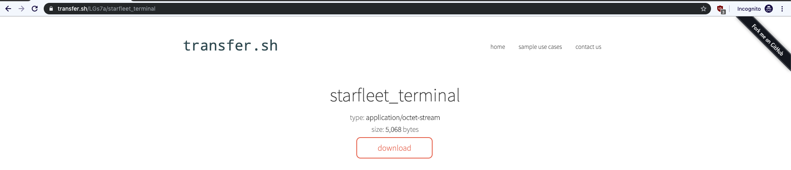

# ThugCrowd Challege #4

## The Challenge
So, in early August 2019, I decided to rejoin twitter under my old username [@javadocs](https://twitter.com/javadocs)). I've been meaning to clean up that account since I had not posted in about ~8 years on it. After cleaning it up, I followed a bunch of InfoSec twitter accounts, and since I did that, I saw [this tweet](https://twitter.com/thugcrowd/status/1158172622577946625) in my feed. (Shout out to the person who used the name *2Spock*)


## My Attempts at the Solution


### Step 0
All we are givin is this string. 

```
YmVnaW4gNjY0IHVybApNOicxVDwnLForUl1UPEYlTjxWOUU8QllTOiJdLDFXLFc4Ml1TPSYlUjlGUUU5NzE/PSY1Ujs2RU44NlAqCmAKZW5kCg==
```


### Step 1
It looks like some some of base encoding, so I tried the most common one - base64.

```
$ echo "YmVnaW4gNjY0IHVybApNOicxVDwnLForUl1UPEYlTjxWOUU8QllTOiJdLDFXLFc4Ml1TPSYlUjlGUUU5NzE/PSY1Ujs2RU44NlAqCmAKZW5kCg==" | base64 --decode
begin 664 url
M:'1T<',Z+R]T<F%N<V9E<BYS:"],1W,W82]S=&%R9FQE971?=&5R;6EN86P*
`
end
```

### Step 3
Neat. We got some readable text out of it. It's probably just more encoding. I did a quick google of the first line (`begin 664 url`) to see if there was any info on the format. I found that it was an encoding format called `uuencode`, and the utility `uudecode` could decode it.

```
$ uudecode -cip uuencoded 
https://transfer.sh/LGs7a/starfleet_terminal
```

### Step 4
Now we have a URL. Let's check that out.

[](images/4-transfer-sh-url.png)

Looks like it wants us to download a file called `starfleet_terminal`, with an nondescript filetype. I downloaded it and checked it out.

```
$ file starfleet_terminal 
starfleet_terminal: ELF 64-bit LSB shared object x86-64, version 1 (SYSV), statically linked, stripped
$ strings starfleet_terminal
UPX!

[--- Removed "garbage" strings for brevity (There were 122 strings in total) ---]

$Info: This file is packed with the UPX executable packer http://upx.sf.net $
$Id: UPX 3.94 Copyright (C) 1996-2017 the UPX Team. All Rights Reserved. $

[--- More "garbage" strings ---]

UPX!
UPX!
```

The words UPX comes up a bunch and we have another URL in the file. While it's clearly an ELF file, let's check out the URL and see if there's some more hidden stuff we can expose. The description for the utility is as follows:

> UPX is a free, portable, extendable, high-performance executable packer for several executable formats.

Looks like this has been compressed a bit. Let's try to reverse that.

```
$ upx -do starfleet_terminal_decompressed starfleet_terminal
                       Ultimate Packer for eXecutables
                          Copyright (C) 1996 - 2018
UPX 3.95        Markus Oberhumer, Laszlo Molnar & John Reiser   Aug 26th 2018

        File size         Ratio      Format      Name
   --------------------   ------   -----------   -----------
     16450 <-      5068   30.81%   linux/amd64   starfleet_terminal_decompressed

Unpacked 1 file.

$ file starfleet_terminal_decompressed
starfleet_terminal_decompressed: ELF 64-bit LSB shared object x86-64, version 1 (SYSV), for GNU/Linux 3.2.0, BuildID[sha1]=17f312b0279669021ac1fd51f1aa39c42a773bad, dynamically linked, interpreter \004, stripped

$ strings starfleet_terminal_decompressed 
/lib64/ld-linux-x86-64.so.2
libc.so.6
exit
signal
puts
sleep
__cxa_finalize
__libc_start_main
GLIBC_2.2.5
_ITM_deregisterTMCloneTable
__gmon_start__
_ITM_registerTMCloneTable
u3UH
[]A\A]A^A_
ENTERPRISE TERMINAL:
ESTABLISHING SIGNAL...
CONNECTION ESTABLISHED
 ... INCOMING EMERGENCY BROADCAST
 ...
 ...
 ... ACCEPTING BROADCAST MESSAGE
 ... 
                                                                                 
                                                                                 
                                                                                 
                                                                                 
                                        .                                        
                                       .:.                                       
                                      .:::.                                      
                                     .:::::.                                     
                                 ***.:::::::.***                                 
                            *******.:::::::::.*******                            
                          ********.:::::::::::.********                          
                         ********.:::::::::::::.********                         
                         *******.::::::'***`::::.*******                         
                         ******.::::'*********`::.******                         
                          ****.:::'*************`:.****                          
                            *.::'*****************`.*                            
                            .:'  ***************    .                            
                           .                                                     
   ##############################################################################
   ##############################################################################
   ##########################        BROADCAST       ############################
   ##############################################################################
   ##############################################################################
   #**********************************ORIGIN************************************#
   #                                                                            #
   #                              STARFLEET SHIP                                #
   #----------------------------------------------------------------------------#
   #                                                                            #
   #                              USS VENGEANCE                                 #
   #                                                                            #
   #****************************************************************************#
   #                                                                            #
   #                               REGISTRY ID                                  #
   #----------------------------------------------------------------------------#
   #                                                                            #
   #                               NCC-177358                                   #
   #                                                                            #
   #*********************************MESSAGE************************************#
   # MAYDAY                                                                     #
   #                                                                            #
   # MAYDAY                                                                     #
   #                                                                            #
   # WE HAVE BEEN BOARDED BY KAHN, HE IS COMMANDEERING THE SHIP.                #
   #                                                                            #
   # HE HAS KILLED ADMIRAL MARCUS                                               #
   #                                                                            #
   # HE IS NOW TRANSPORTING SEVENTY TWO ADVANCED LONG-RANGE TORPEDOES           #
   #                                                                            #
   # WE BELIEVE HE IS AIMING FOR STARFLEET HEADQUATERS                          #
   #                                                                            #
   # THE ENTERPRISE IS HEAVILY DAMAGED                                          #
   #                                                                            #
   #**********************************ERROR*************************************#
   SIGNAL LOST ....
   ...
   ATTEMTPING TO REESTABLISH  ...........
   .......
   ............
   .............
   UNABLE TO ESTABLISH CONNECTION ............. 
   ....
   ARCHIVING MESSAGE.. 
   .........
   .............. 
   ARCHIVED MESSAGE : 
     /Td6WFoAAATm1rRGAgAhARYAAAB0L+WjAQCeH4sICMA2Rl0AA2N0NjQAHcvRCoIwFADQd79GW0E9 
     NsF5lw1MnfO+6RYzu6tAMvz7qPdz6qAZ5JI6JpPelDPkjgahlqFtvBN7r8WYYIwztjoubrzp24RA 
     UABxCJBfnlhxskzREBRFRcpXNHyxj/Kf3WYkG/TLsh/cTb3IYhDZG1M+dUau14ovzpS+ZvKOBvx5 
     On5UtT1FXxDiLoKWAAAAAABY3YwVRBDWWgABtwGfAQAAZUUbHbHEZ/sCAAAAAARZWg== 
;*3$"
```


### Step 5

Jackpot. More progress. Now we have some fancy ASCII text, with another hash at the bottom. It looks like another base64 hash, so let's try that.

```
$ echo "/Td6WFoAAATm1rRGAgAhARYAAAB0L+WjAQCeH4sICMA2Rl0AA2N0NjQAHcvRCoIwFADQd79GW0E9NsF5lw1MnfO+6RYzu6tAMvz7qPdz6qAZ5JI6JpPelDPkjgahlqFtvBN7r8WYYIwztjoubrzp24RAUABxCJBfnlhxskzREBRFRcpXNHyxj/Kf3WYkG/TLsh/cTb3IYhDZG1M+dUau14ovzpS+ZvKOBvx
5\On5UtT1FXxDiLoKWAAAAAABY3YwVRBDWWgABtwGfAQAAZUUbHbHEZ/sCAAAAAARZWg==" | base64 --decode
Invalid character in input stream.
```

Hmm. The `==` at the end is definitely base64 padding, so that's odd. Also note that there are a bunch of `/`'s and `+`'s. I know base64 "alt characters" are a thing, so let's just write some quick python to see if that spits out anything.

**5-decode.py**
```python
#!/usr/bin/env python
import base64
data = r"/Td6WFoAAATm1rRGAgAhARYAAAB0L+WjAQCeH4sICMA2Rl0AA2N0NjQAHcvRCoIwFADQd79GW0E9NsF5lw1MnfO+6RYzu6tAMvz7qPdz6qAZ5JI6JpPelDPkjgahlqFtvBN7r8WYYIwztjoubrzp24RAUABxCJBfnlhxskzREBRFRcpXNHyxj/Kf3WYkG/TLsh/cTb3IYhDZG1M+dUau14ovzpS+ZvKOBvx5On5UtT1FXxDiLoKWAAAAAABY3YwVRBDWWgABtwGfAQAAZUUbHbHEZ/sCAAAAAARZWg=="
z = base64.b64decode(data, altchars="+/")
print(z)
```

```
$ ./5-decode.py          
b'\xfd7zXZ\x00\x00\x04\xe6\xd6\xb4F\x02\x00!\x01\x16\x00\x00\x00t/\xe5\xa3\x01\x00\x9e\x1f\x8b\x08\x08\xc06F]\x00\x03ct64\x00\x1d\xcb\xd1\n\x820\x14\x00\xd0w\xbfF[A=6\xc1y\x97\rL\x9d\xf3\xbe\xe9\x163\xbb\xab@2\xfc\xfb\xa8\xf7s\xea\xa0\
x19\xe4\x92:&\x93\xde\x943\xe4\x8e\x06\xa1\x96\xa1m\xbc\x13{\xaf\xc5\x98`\x8c3\xb6:.n\xbc\xe9\xdb\x84@P\x00q\x08\x90_\x9eXq\xb2L\xd1\x10\x14EE\xcaW4|\xb1\x8f\xf2\x9f\xddf$\x1b\xf4\xcb\xb2\x1f\xdcM\xbd\xc8b\x10\xd9\x1bS>uF\xae\xd7\x8a/\
xce\x94\xbef\xf2\x8e\x06\xfcy:~T\xb5=E_\x10\xe2.\x82\x96\x00\x00\x00\x00\x00X\xdd\x8c\x15D\x10\xd6Z\x00\x01\xb7\x01\x9f\x01\x00\x00eE\x1b\x1d\xb1\xc4g\xfb\x02\x00\x00\x00\x00\x04YZ'
```

A bunch of escaped characters pop out, but if you look at the un-escaped characters, you can see the characters `7z` near the front of the string. It was pretty hard to notice until I just replaced all the escaped characters with spaces.

*Regex replace on `\\x[a-zA-Z0-9]{2}` with a single space*
```
b' 7zXZ      F  !     t/          6F]  ct64    \n 0   w F[A=6 y \rL     3  @2    s  \
x19  :&   3      m  {   ` 3 :.n    @P q  _ Xq L   EE W4|     f$      M  b   S>uF   /\
xce  f    y:~T =E_  .       X   D  Z        eE    g       YZ'
```

I added a few lines to `5-decode.py` to output the decoded string to a file, and took a look at it.

```
#!/usr/bin/env python
import base64
data = r"/Td6WFoAAATm1rRGAgAhARYAAAB0L+WjAQCeH4sICMA2Rl0AA2N0NjQAHcvRCoIwFADQd79GW0E9NsF5lw1MnfO+6RYzu6tAMvz7qPdz6qAZ5JI6JpPelDPkjgahlqFtvBN7r8WYYIwztjoubrzp24RAUABxCJBfnlhxskzREBRFRcpXNHyxj/Kf3WYkG/TLsh/cTb3IYhDZG1M+dUau14ovzpS+ZvKOBvx5On5UtT1FXxDiLoKWAAAAAABY3YwVRBDWWgABtwGfAQAAZUUbHbHEZ/sCAAAAAARZWg=="
z = base64.b64decode(data, altchars="+/")
print(z)

with open("out.7z", "wb") as fh:
  fh.write(z)
print("Decoded bytes written to file: out.7z")
```

```
$ ./5-decode.py                                 
b'\xfd7zXZ\x00\x00\x04\xe6\xd6\xb4F\x02\x00!\x01\x16\x00\x00\x00t/\xe5\xa3\x01\x00\x9e\x1f\x8b\x08\x08\xc06F]\x00\x03ct64\x00\x1d\xcb\xd1\n\x820\x14\x00\xd0w\xbfF[A=6\xc1y\x97\rL\x9d\xf3\xbe\xe9\x163\xbb\xab@2\xfc\xfb\xa8\xf7s\xea\xa0\x19\xe4\x92:&\x93\xde\x943\xe4\x8e\x06\xa1\x96\xa1m\xbc\x13{\xaf\xc5\x98`\x8c3\xb6:.n\xbc\xe9\xdb\x84@P\x00q\x08\x90_\x9eXq\xb2L\xd1\x10\x14EE\xcaW4|\xb1\x8f\xf2\x9f\xddf$\x1b\xf4\xcb\xb2\x1f\xdcM\xbd\xc8b\x10\xd9\x1bS>uF\xae\xd7\x8a/\xce\x94\xbef\xf2\x8e\x06\xfcy:~T\xb5=E_\x10\xe2.\x82\x96\x00\x00\x00\x00\x00X\xdd\x8c\x15D\x10\xd6Z\x00\x01\xb7\x01\x9f\x01\x00\x00eE\x1b\x1d\xb1\xc4g\xfb\x02\x00\x00\x00\x00\x04YZ'
Decoded bytes written to file: out.7z

$ file out.7z
out.7z: XZ compressed data
```

Looks like its able to tell its compressed data. That's good.

### Step 6

Let's crack it open. Using the `7za` utility, I tried to extract it.

```
$ 7za x out.7z

7-Zip (a) [64] 16.02 : Copyright (c) 1999-2016 Igor Pavlov : 2016-05-21
p7zip Version 16.02 (locale=utf8,Utf16=on,HugeFiles=on,64 bits,8 CPUs x64)

Scanning the drive for archives:
1 file, 220 bytes (1 KiB)

Extracting archive: out.7z
WARNING:
out.7z
Can not open the file as [7z] archive
The file is open as [xz] archive

--
Path = out.7z
Open WARNING: Can not open the file as [7z] archive
Type = xz
Physical Size = 220
Method = LZMA2:23 CRC64
Streams = 1
Blocks = 1

Everything is Ok

Archives with Warnings: 1
Size:       159
Compressed: 220
```

The warnings are a little scary, but it says everything is okay. Let's check it out.

### Step 7

Let's check out the file next. One file was extracted, a single file named `out`. Let's poke at it.

```
$ cat out
�6F]ct64��
L���3��@2����s��:&�ޔ3����m�{�Ř`�3�:.n��ۄ@P�_�Xq�L�EE�W4|����f$˲�M��b�>uF�׊/Δ�f��y:~T�=E_�.��

$ file out
out: gzip compressed data, was "ct64", last modified: Sun Aug  4 01:37:04 2019, from Unix, original size 150
```

Hey, look, it's gzip compressed. Let's keep going. Let's take a look at the files.

```
# Let's rename out to include a gzip extension
$ mv out out.gz 

$ gunzip -l out.gz
  compressed uncompressed  ratio uncompressed_name
         159          150  -5.4% out

$ gunzip -c out.gz
TmV3IHJlY3J1aXQsIHdlbGNvbWUgdG8gVGh1Z0ZsZWV0LiBUaW1lIGlmIG9mIHRoZSBlc3NlbmNl
LCByZXBvcnQgdG8gd2hlcmVpc3RoZS5jaGF0IGFuZCBjYXJyeSBvdXQgT3JkZXIgMjAwNS4K
```

More hashes. Yay! /s

### Step 8

Let's try a base64 decode one more time.
```
$ echo "TmV3IHJlY3J1aXQsIHdlbGNvbWUgdG8gVGh1Z0ZsZWV0LiBUaW1lIGlmIG9mIHRoZSBlc3NlbmNlLCByZXBvcnQgdG8gd2hlcmVpc3RoZS5jaGF0IGFuZCBjYXJyeSBvdXQgT3JkZXIgMjAwNS4K" | base64 --decode
New recruit, welcome to ThugFleet. Time if of the essence, report to whereisthe.chat and carry out Order 2005.
```

More links! Time to go down the rabbit hole some more.

### Step 9

Before going to the site directly. Let's poke at it with dig and nmap.
```
$ dig whereisthe.chat

; <<>> DiG 9.10.6 <<>> whereisthe.chat
;; global options: +cmd
;; Got answer:
;; ->>HEADER<<- opcode: QUERY, status: NOERROR, id: 54389
;; flags: qr rd ra; QUERY: 1, ANSWER: 1, AUTHORITY: 0, ADDITIONAL: 1

;; OPT PSEUDOSECTION:
; EDNS: version: 0, flags:; udp: 4096
;; QUESTION SECTION:
;whereisthe.chat.               IN      A

;; ANSWER SECTION:
whereisthe.chat.        247     IN      A       75.126.100.5

;; Query time: 31 msec
;; SERVER: 192.168.128.1#53(192.168.128.1)
;; WHEN: Mon Aug 05 18:18:35 CDT 2019
;; MSG SIZE  rcvd: 60

$ nmap -sT whereisthe.chat
Starting Nmap 7.70 ( https://nmap.org ) at 2019-08-05 18:19 CDT
Nmap scan report for whereisthe.chat (75.126.100.5)
Host is up (0.037s latency).
rDNS record for 75.126.100.5: 5.64.7e4b.ip4.static.sl-reverse.com
Not shown: 996 closed ports
PORT     STATE    SERVICE
19/tcp   filtered chargen
22/tcp   filtered ssh
80/tcp   open     http
1720/tcp open     h323q931

Nmap done: 1 IP address (1 host up) scanned in 1.68 seconds
```

HTTP is open, so let's try a quick `curl` on that. I did a curl on port 1720, but the request times out. Let's put that in our back pocket for now.

```
$ curl whereisthe.chat -if
HTTP/1.1 301 Moved Permanently
Server: nginx
Date: Mon, 05 Aug 2019 18:21:03 GMT
Content-Type: text/html; charset=UTF-8
Transfer-Encoding: chunked
Connection: keep-alive
Location: 35.238.179.129
```

It's trying to forward us, so let's take a look at the destination, using `dig` to do a reverse lookup, and `nmap` to do a quick scan.
```
$ dig -x 35.238.179.129

; <<>> DiG 9.10.6 <<>> -x 35.238.179.129
;; global options: +cmd
;; Got answer:
;; ->>HEADER<<- opcode: QUERY, status: NOERROR, id: 32263
;; flags: qr rd ra; QUERY: 1, ANSWER: 1, AUTHORITY: 0, ADDITIONAL: 1

;; OPT PSEUDOSECTION:
; EDNS: version: 0, flags:; udp: 4096
;; QUESTION SECTION:
;129.179.238.35.in-addr.arpa.   IN      PTR

;; ANSWER SECTION:
129.179.238.35.in-addr.arpa. 120 IN     PTR     129.179.238.35.bc.googleusercontent.com.

;; Query time: 262 msec
;; SERVER: 192.168.128.1#53(192.168.128.1)
;; WHEN: Mon Aug 05 18:26:20 CDT 2019
;; MSG SIZE  rcvd: 109

$ nmap -sT 35.238.179.129
Starting Nmap 7.70 ( https://nmap.org ) at 2019-08-05 18:27 CDT
Nmap scan report for 129.179.238.35.bc.googleusercontent.com (35.238.179.129)
Host is up (0.050s latency).
Not shown: 996 filtered ports
PORT     STATE  SERVICE
22/tcp   open   ssh
80/tcp   open   http
1720/tcp open   h323q931
3389/tcp closed ms-wbt-server

Nmap done: 1 IP address (1 host up) scanned in 6.85 seconds
```

Another HTTP port. Let's take a look at that. We'll save the other ports for later, if they come up.

```
$ curl 35.238.179.129
�PNG

���Y�ɞa5��x3��#3�_vGHEO��L����)%ޙ�/` �i���ȇҮ�i����͏B��Q��xɜ����p@ �H �H ��/ K��G,#�X�f,�;�Ϛtz�   $�S@���p�3]���-��������̀�ӵ�ܑ@=�f�l�
                               W�p��%��;H����
                                             ˏ���

                                                 �s�.Sa
|����h�5(�礳;�!)n&����4]�:{rw��{4��D�
                                     �s���d��jd�
��'+f�-���s<[>[�fAɲݷ�:@m<PN��Y�@���|��٧o�z���,��3@�Kҹ�^qGl�4%����͕�~C��S\/{︗,:;ɏ!       ���E��������x��{���'�
W�ϋY<[�/�GH�:FDn�;xXم��h�%k���(�g�                                                                           �T5W��T%P����L�y��/�d�<���[K�l�
                                  �
                                   J��h����j�є�^r�n�Y� ��IPU�B ����s��IS�$)�"��9P��*���n�~��U�-P{�JgW��=b�P�ۏ$�l����z�U�^��e�.�#@��ȲjTų���c}я�ŮtI��F�g
                                                                                                                                                      �0h�ZU
���~;���0]wٛ��)�%_rG     ���|n ��\חJ�y��u[9H���n��x�`��)|l6�р.����nO�#�z�ʆ:,5`Sc
                                                                               $
�|�f~Γ��|t�Ӱ��)i3y6奚%��;H�o��?�:i|�<���d��Hg                                   [�p3�7�6p���Ԉ@
                                             �"�Kr
������!:�{�]�Ⅎl���}��ݵE�e؁�?S:iB*�S<[�Au���!S�@��lvS�y��1X�-P[�bٞ�]U�]����a      x��ݵ�r�S�����ZZ���5     ��
                                                                                                          /G�?��[�>6�\?�ʉ/?���H ���*E��P'���r�e\C��@m�J�H       LCUᗦX�j�/��ʒe
��r�Kn���b��lu��v�5���� XFҠ(փ���A�=�@o                                                                                                                                       ��nY�f����>�s���R�6A��XK�L �
z|�X�?��>�}ʈ|�@�h-/P�#�s�n˰����J���~z�  $��A�x��v����k�f������wy4����_̗��m���rt�u��@J
v�����h�5��.Ctr6��}be=qG:[�6A�Y���nYq�>�[DG��y�v"O#i��zO����W��ޣ        $�@     $�@     $��
                                                                                           ����|8y�IEND�B`�
```

Look like its a png, so let's download that. We get this, a QR code.


Reading the QR code with my phone asks me if I want to open it up in Google Authenticator, which means its a Google Auth OTP?


We'll save that for later. Let's take a look at the QR code's content first, using `zbarimg`.

```
$ zbarimg images/9-qr-code.png
QR-Code:otpauth://totp/StarThug:you@thu.gg?issuer=OperationSelfDestruct&algorithm=SHA1&digits=6&period=30&secret=GE3DCLRSGI2S4OJWFYZTELRR&port=42069
scanned 1 barcode symbols from 1 images in 0.03 seconds
```

The secret above has been changed to a random IP (and the QR code has been regenerated too), but it was a base32-encoded my external IP address with an extra `.1` on the end. Other than that, I googled `otpauth://totp` and looked for some documentation on the format, and found this page on [github](https://github.com/google/google-authenticator/wiki/Key-Uri-Format). Looking at the docs, I saw that these query params are the ones that matter to the OTP URI - `secret`, `issuer`, `algorithm`, `digits`, `counter`, and `period`. I then noticed that there was an extra query string parameter in the QR code - `port`. A hint, perhaps?

### Step 10

I scanned a few of the sites and IPs on that port (like whereisthe.chat and 35.238.179.129), and saw that 35.238.179.129 had found port 42069 open, so I poked it with curl
```
$ nmap -p 42069 35.238.179.129 

Starting Nmap 7.70 ( https://nmap.org ) at 2019-08-05 19:59 CDT
Nmap scan report for 129.179.238.35.bc.googleusercontent.com (35.238.179.129)
Host is up (0.043s latency).

PORT      STATE SERVICE
42069/tcp open  unknown

Nmap done: 1 IP address (1 host up) scanned in 0.29 seconds

$ curl -i 35.238.179.129:42069
DESTRUCT SEQUENCE
    ONE      
  CODE:ABORTING
DESTRUCT SEQUENCE
    ONE      
```

The odd thing is that my terminal is waiting for the connection to close, but nothing is happening. Hmmm. That, and the fact that we aren't getting HTTP headers back, means that its probably not an HTTP port. Let's try with `nc`.

```
$ nc 35.238.179.129 42069
DESTRUCT SEQUENCE
    ONE      
  CODE:951015
ABORTING
DESTRUCT SEQUENCE
    ONE      
  CODE:2005
ABORTING
DESTRUCT SEQUENCE
    ONE      
  CODE:1720
ABORTING
DESTRUCT SEQUENCE
    ONE      
  CODE:42069
ABORTING
DESTRUCT SEQUENCE
    ONE      
  CODE:
```

The codes that I tried are the following: 
* `951015` - My OTP code at the time of me trying.
* `1720` - The other open port number from `whereisthe.chat` and the current IP I'm connecting to.
* `2005` - The number from the 'Welcome New Recruit' message - Order 2005
* `42069` - The port number that I'm connecting to, which has other significance. 

No dice.

### Stuck :(

At this point, I'm stuck. I went to a conference for the last few days, so I haven't really had time to sit down and figure this out. I still have some more time as of writing this, so let's hope that I can re-look over some stuff and see if I missed anything.

### Step 10 - Part 2 (Unstuck)

So, a few days later, I took a look at the twitter replies to the original one, and saw that someone said that the OTP isn't the first thing thats entered. They mentioned some unknown Youtube video, and said that that's not how the code is entered. So, maybe I need to look up some Star Trek specifics (I've watched the stuff from the 90's but never paid attention to the codes they said, lol).

I ended up finding [this Star Trek fan wiki article](https://memory-beta.fandom.com/wiki/Self_destruct) on the self-destruct sequence. The important part is as follows:

>The Captain would give the first destruct sequence, which was "Code 1,1A." The first officer would then give the second part, which was "Code 1,1A,2B." Then the chief engineer would give the third sequence, which was "Code 1B,2B,3." The computer would then announce that the sequence was complete, and would request the final sequence to activate the self-destruct sequence. The Captain would give the final sequence, which was the words "Zero-Zero-Zero Destruct Zero." Once the final code was given, the auto-destruct would begin, counting down from 30 seconds.".

So, I tried that.

```
$ nc 35.238.179.129 42069
DESTRUCT SEQUENCE
    ONE
  CODE:11A
DESTRUCT SEQUENCE
    TWO
  CODE:11A2B
DESTRUCT SEQUENCE
   THREE
  CODE:1B2B3

DESTRUCT SEQUENCE
 COMPLETED
   AND ENGAGED

  AWAITING
 FINAL CODE
  FOR 30-SECOND
    COUNTDOWN

  AWAITING
 FINAL CODE
  FOR 30-SECOND
    COUNTDOWN

  CODE:914022
ENCRYPTED MESSAGE FROM THUGFLEET               .
              .:.
             .:::.
            .:::::.
        ***.:::::::.***
   *******.:::::::::.*******
 ********.:::::::::::.********
********.:::::::::::::.********
*******.::::::'***`::::.*******
******.::::'*********`::.******
 ****.:::'*************`:.****
   *.::'*****************`.*
   .:'  ***************    .
  .
d0twTkR1ZFJ8dWQXRWVkcn8UHxZCbk1Ob2BKUEJ1ZFxEFF4UfHF3QUJhTkpvbmQXQ0hWVXx1Y0F0FB5BQmEeQUVLSlBCZRNWRHVkFkRfZExFS3BOQmFzQX9xEkF/cWhMRBVwU0JlEkFwYU5KRE9kV0QUSlNvZWhPRBVsSGlLTlBCYV5WREtzU39LXlZETxNIfF9kTkRLd0FCbkpRfHVnTn9+cBZHZWRicWMTaUIUYFFEbnRecxdkdn8XcHFwbmBjRxZOV38UYHFwcGwSd018bHdBGxs=
```

Really? That was the correct sequence, with the OTP being the final command code? *Groan*. Well played [@ThugCrowd](https://twitter.com/thugcrowd). At least now, I have the next piece in the puzzle.

### Part 11

```
d0twTkR1ZFJ8dWQXRWVkcn8UHxZCbk1Ob2BKUEJ1ZFxEFF4UfHF3QUJhTkpvbmQXQ0hWVXx1Y0F0FB5BQmEeQUVLSlBCZRNWRHVkFkRfZExFS3BOQmFzQX9xEkF/cWhMRBVwU0JlEkFwYU5KRE9kV0QUSlNvZWhPRBVsSGlLTlBCYV5WREtzU39LXlZETxNIfF9kTkRLd0FCbkpRfHVnTn9+cBZHZWRicWMTaUIUYFFEbnRecxdkdn8XcHFwbmBjRxZOV38UYHFwcGwSd018bHdBGxs=
```

An encrypted string, according to the message. Hmmm. Stuck again. :(

