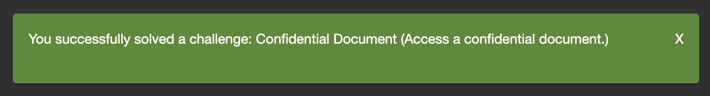
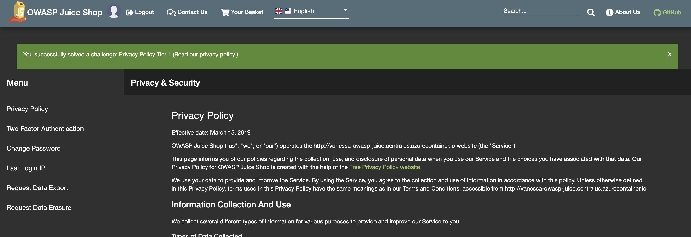
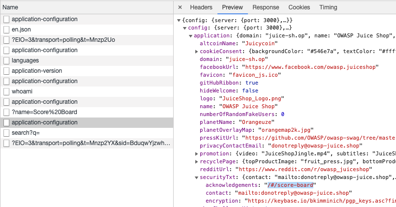
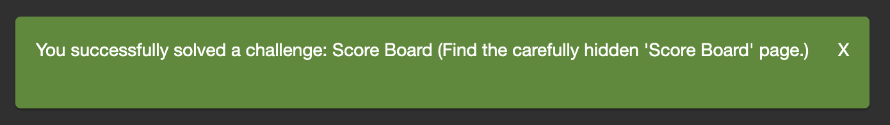
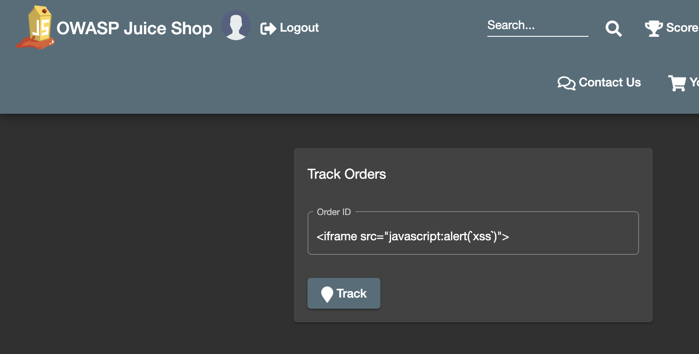
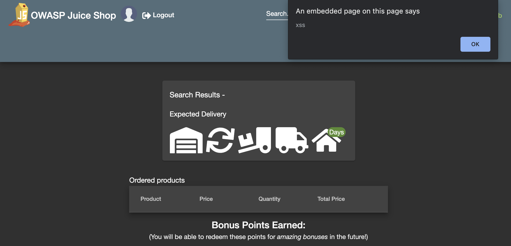
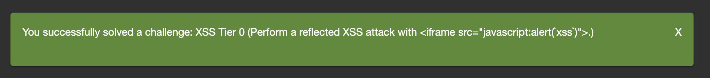
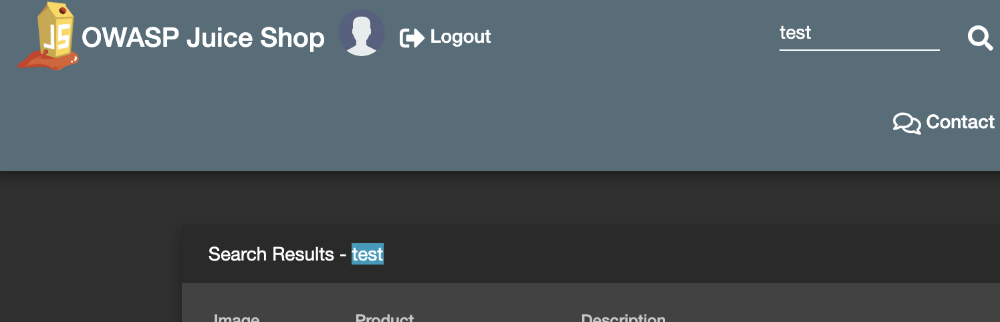
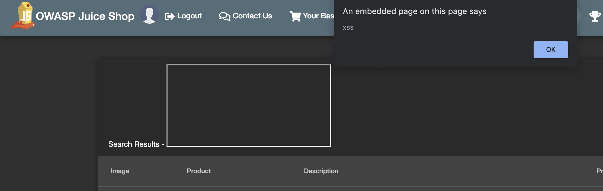
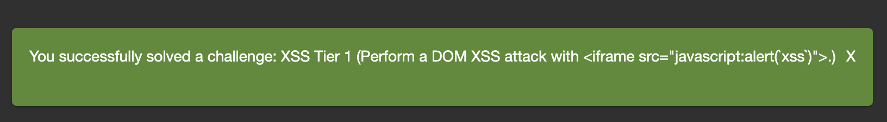

# Level 1 - Trivial Challenges

## Challenges

| Challenge | Description | Status |
| --- | --- | --- |
| Confidential Document | Access a confidential document. | :white_check_mark:
| Error Handling | Provoke an error that is not very gracefully handled. | :heavy_minus_sign:
| Privacy Policy Tier 1 | Read our privacy policy. | :white_check_mark:
| Redirects Tier 1 | Let us redirect you to one of our crypto currency addresses which are not promoted any longer. | :heavy_minus_sign:
| Repetitive Registration | Follow the DRY principle while registering a user. | :heavy_minus_sign:
| Score Board | Find the carefully hidden 'Score Board' page. | :white_check_mark:
| XSS Tier 0 | Perform a reflected XSS attack with an iframe alerting XSS. | :white_check_mark:
| XSS Tier 1 | Perform a DOM XSS attack with an iframe alerting XSS. | :white_check_mark:
| Zero Stars | Give a devastating zero-star feedback to the store. | :heavy_minus_sign:

## Solutions

### Confidential Document
> Access a confidential document.

* Solved? :white_check_mark:
* Tools Used: Just Chrome

Pretty easy. Poking around the site, there's a link to a `legal.md` file (for more info on their stuff) that leads to a site path `<root>/ftp/legal.md`. Just remove the `legal.md` and you'll find a few files that should probably not be public, like `acquisitions.md`.

```
# Planned Acquisitions

> This document is confidential! Do not distribute!

Our company plans to acquire several competitors within the next year.
This will have a significant stock market impact as we will elaborate in
detail in the following paragraph:

Lorem ipsum dolor sit amet, consetetur sadipscing elitr, sed diam nonumy
eirmod tempor invidunt ut labore et dolore magna aliquyam erat, sed diam
voluptua. At vero eos et accusam et justo duo dolores et ea rebum. Stet
clita kasd gubergren, no sea takimata sanctus est Lorem ipsum dolor sit
amet. Lorem ipsum dolor sit amet, consetetur sadipscing elitr, sed diam
nonumy eirmod tempor invidunt ut labore et dolore magna aliquyam erat,
sed diam voluptua. At vero eos et accusam et justo duo dolores et ea
rebum. Stet clita kasd gubergren, no sea takimata sanctus est Lorem
ipsum dolor sit amet.

Our shareholders will be excited. It's true. No fake news.
```

I know that this is a faux FTP directory, but don't use your web servers for FTP! Don't use FTP at all, imo. It's slow, insecure, and old! Solved.



### Error Handling
> Provoke an error that is not very gracefully handled.

* Solved? :heavy_minus_sign:
* Tools Used: :heavy_minus_sign:

TODO 

### Privacy Policy Tier 1
> Read our privacy policy.

* Solved? :white_check_mark:
* Tools Used: Just Chrome

This one was funny. I stumbled upon it just clicking on links, looking if I could find the scoreboard somewhere in the pages. All you need to do is register a user, click on your user's avatar, and go to _Privacy & Security_.



### Redirects Tier 1
> Let us redirect you to one of our crypto currency addresses which are not promoted any longer.

* Solved? :heavy_minus_sign:
* Tools Used: :heavy_minus_sign:

### Repetitive Registration
> Follow the DRY principle while registering a user.


### Score Board
> Find the carefully hidden 'Score Board' page.

* Solved? :white_check_mark:
* Tools Used: Chrome, Chrome Inspector

Not so carefully hidden when the application calls an endpoint to populate settings, and the scoreboard is in the settings.



You could also basically just try a bunch of score-board variations and probably get it eventually. Either way, solved!



### XSS Tier 0
> Perform a reflected XSS attack with an iframe alerting XSS.
* Solved? :white_check_mark:
* Tools Used: Chrome, Chrome Inspector

My first thought when I saw that reflected was the "tier 0" challenge and DOM-based was the "tier 1" challenge was that it was weird. Either way, we need to look for a request that sends a request to the backend with an XSS payload, and see if any of them don't sanitize the request after it is returned to the front-end, as well as the front-end not sanitizing it. First, we need to find an input that sends something to the backend API as an XHR request.

I opened up the network tab on Chrome and looked at the requests being sent to and from the backend. After a few inputs, I noticed that the _Track Order_ page was sending back sanitized markup in its response, so this was probably it.

**Chrome Request**
```
# Chrome URI-encoded this string <b>x</b> to %3Cb%3Ex%3C%2Fb%3E
<root>/rest/track-order/%3Cb%3Ex%3C%2Fb%3E
```
**Response JSON**
```
{"status":"success","data":[{"orderId":"<b>x</b>"}]}
```

Now, let's try the iframe payload to solve the challenge.



And it look like it worked!



Never trust user input, at any level! Solved!



### XSS Tier 1
> Perform a DOM XSS attack with an iframe alerting XSS.

* Solved? :white_check_mark:
* Tools Used: Chrome, Chrome Inspector

Pretty easy as well. I noticed when I searched something in the top bar, that it would also use that same value in the search result page.



Let's try putting the iframe tag in there, and see if that works.



Yep, it did. Always sanitize user input, even on the front end! Solved!



### Zero Stars
>  Give a devastating zero-star feedback to the store.

* Solved? :heavy_minus_sign:
* Tools Used: Chrome, Chrome Inspector, curl

TODO